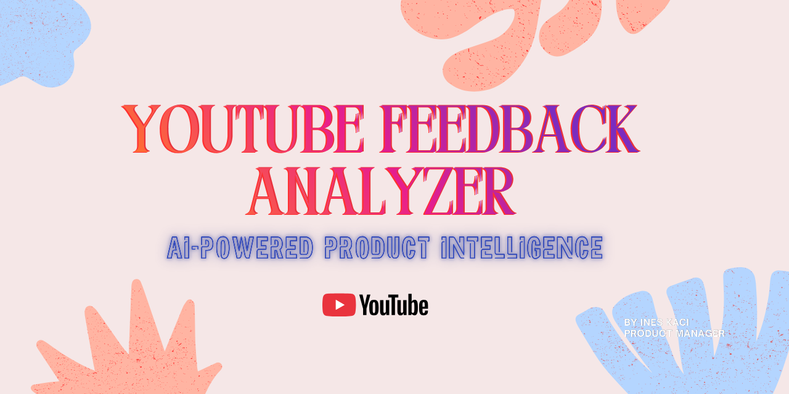

# 🎯 YouTube Feedback Analyzer

> Turns 500 YouTube comments into actionable insights in 2 minutes with AI

---

## 📊 The Problem

As a Product Manager, analyzing user feedback on YouTube is **time-consuming**:
- 500+ comments per video
- 5–10 hours of manual reading
- Risk of missing critical insights

## 💡 The Solution

An AI dashboard that automatically analyzes YouTube comments and generates:

✅ **Pain Points Clustering** — Recurring issues with their frequency and severity  
✅ **Recommended Actions** — Prioritized sprint actions derived from user feedback  
✅ **Sentiment Analysis** — Positive / Neutral / Negative breakdown per analysis  
✅ **Comment Filters** — Browse comments by sentiment directly in the dashboard  
✅ **Executive Summary** — Concise report for stakeholders  

---

## 🛠️ Tech Stack

- **Backend**: Ruby on Rails 8
- **Database**: PostgreSQL
- **AI**: Claude API (Anthropic)
- **APIs**: YouTube Data API v3
- **Frontend**: Hotwire (Turbo + Stimulus) + Tailwind CSS
- **Charts**: Chart.js
- **Deploy**: Render.com

---

## 🚀 Project Status

**✅ Shipped — Core features live in production**

- [x] Repo setup & project structure
- [x] Rails app configuration
- [x] YouTube API integration (comments + video metadata)
- [x] Claude AI integration
- [x] Pain Points Clustering with severity scoring
- [x] Recommended Actions grouped by sprint
- [x] Sentiment analysis with percentage breakdown
- [x] Comment filters by sentiment
- [x] Analysis history page
- [x] Unified design system + animated loading screen
- [x] Deployed to production on Render.com

---

## 📚 Documentation

This project is built **in public** with full documentation:

- [📋 Product Brief](docs/PRODUCT_BRIEF.md) — Vision, features, roadmap
- [🔧 Tech Decisions](docs/TECH_DECISIONS.md) — Architectural decisions
- [📅 Weekly Updates](docs/weekly-updates/) — Weekly progress
- [🤖 AI Usage](docs/ai-usage/) — How AI was used throughout the project
- [🎨 Portfolio](docs/portfolio/) — Case study & demo

---

## 👤 Author

**Inès Kaci**  
Product Manager — Le Wagon São Paulo, Batch #2203

🔗 [LinkedIn](https://linkedin.com/in/ton-profil) | 🐙 [GitHub](https://github.com/Ineskcj)

---

## 📝 License

MIT — This project is open-source, built for learning and portfolio purposes.

---

## 🙏 Build in Public

This project is publicly documented to:
- Share my learnings
- Help other PMs transitioning into tech
- Showcase my product process

**Follow my progress** and feel free to ask questions or suggest improvements!

⭐ If this project inspires you, leave a star!
